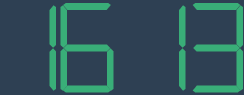

# digital-clock-vue

[](https://github.com/zkerhcy/digital-clock-vue/blob/master/LICENSE)

> A digital clock simulation build on Vue.


without seconds:



You can also use the [digital-number](src/digital-number.vue) component.


## Installation

via NPM:

```shell
npm install --save digital-clock-vue
```

via Yarn:

```shell
yarn add digital-clock-vue
```

## Usage

```js
import DigitalClockVue, { DigitalNumber } from 'digital-clock-vue'

export default {
  components: {
    DigitalClockVue,
    DigitalNumber
  }
}
```

## Props

| Prop          | Type    | Desc                                                 |
| ------------- | ------- | ---------------------------------------------------- |
| `color`       | String  | CSS color for digital number and twink.              |
| `showSeconds` | Boolean | Determine whether to show seconds, default is false. |

## Examples

```html
<!-- recommend aspect ratio 4:1 -->
<digital-clock-vue
  color="red"
  showSeconds
  style="background: black; width: 400px; height: 100px;"
/>

<!-- recommend aspect ratio when without seconds 8:3 -->
<digital-clock-vue
  color="#39af78"
  style="background: #2f4053; width: 240px; height: 90px;"
/>

<!-- digital number -->
<div>
  <digital-number
    :key="item"
    :num="item"
    color="#1973de"
    style="width: 45px; height:75px; margin-left: 2px;"
    v-for="item in Array.apply(null, {length: 10}).map((_, i) => i)"
  ></digital-number>
</div>
```

## License

[MIT](http://opensource.org/licenses/MIT)
